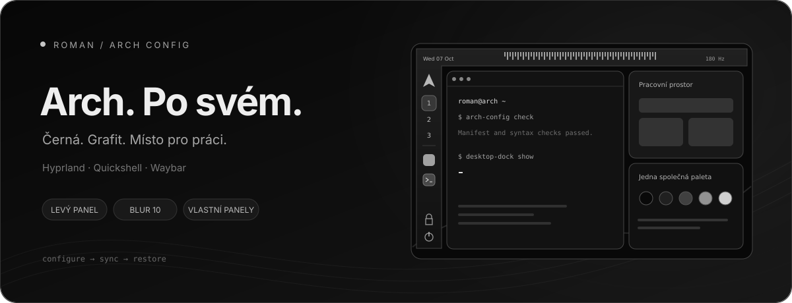

<p align="center">
  
</p>

<h1 align="center">Desktop, který sedí mému workflow.</h1>

<p align="center">Arch Linux · Hyprland · Quickshell · Waybar<br>
Vlastní panely, skleněný dock a konfigurace, ke které se dá vrátit.</p>

<p align="center">
  <a href="#co-je-uvnitř">Co je uvnitř</a> ·
  <a href="#obnova">Obnova</a> ·
  <a href="docs/DESKTOP.md">Ovládání</a> ·
  <a href="docs/MAINTENANCE.md">Správa</a>
</p>

---

Kompletní konfigurace současného Arch Linux desktopu: Hyprland, Quickshell,
Waybar, dock, témata, tapety, audio, schránka, zamykání, vlastní skripty,
systemd služby, SDDM a seznam aplikací. Soukromý repozitář pro obnovu a správu změn.

**Začíná se na funkčním Archu s vytvořeným uživatelem, přístupem k internetu,
`sudo`, Git a Pythonem.** Instalace disků a bootloaderu je mimo rozsah.
Nejde o image disku ani zálohu osobních dat. Arch je rolling release; seznam
pozorovaných verzí zachycuje původní stav, nevynucuje nebezpečný downgrade.

## Co je uvnitř

| Součást | Jak ji používám |
| --- | --- |
| **Hyprland** | Plochy, správa oken, náhledy Alt-Tab a vlastní klávesové zkratky. |
| **Quickshell a Waybar** | Launcher, dashboard, ovládací centrum a stavový panel. |
| **Skleněný dock** | Rychlé spuštění aplikací a ruční skrytí jednou zkratkou. |
| **Společná paleta** | Sladěné GTK, Qt, Kitty, Fuzzel, Waybar a Hyprlock. |
| **Každodenní nástroje** | Tapety, schránka, screenshoty, audio a jas podporovaných monitorů. |
| **Obnova z repozitáře** | Manifest souborů, hardwarové profily, seznamy balíčků a zálohy před přepsáním. |

### Pár zkratek, které stačí na začátek

| Zkratka | Akce |
| --- | --- |
| `Super + Enter` | Terminál Kitty |
| `Super + Space` | Launcher |
| `Super + N` | Ovládací centrum |
| `Super + D` | Dashboard |
| `Super + Ctrl + D` | Zobrazit / skrýt dock |
| `Super + L` | Zamknout desktop |
| `Print` / `Shift + Print` | Výřez / celá plocha |

[Úplný seznam zkratek a chování desktopu →](docs/DESKTOP.md)

## Vyber profil

| Profil | Použití |
| --- | --- |
| `generic` | Jiný počítač. Společný vzhled a ovládání; ovladač, kernel a mikrokód připravíš v základním Archu. |
| `current-pc` | Původní sestava. Zahrnuje její systémové balíčky a konfiguraci monitorů. |

## Obnova

```bash
git clone https://github.com/RomanKaxo/arch-config.git
cd arch-config
./arch-config check --profile current-pc
./arch-config install --component system --profile current-pc --dry-run
sudo ./arch-config install --component system --profile current-pc --home "$HOME"
./arch-config packages --profile current-pc
./arch-config install --profile current-pc
./arch-config extras --profile current-pc
./arch-config activate --component system --profile current-pc
./arch-config activate --profile current-pc
```

Před příkazem `packages` musí být funkční pacman mirrorlist a klíčenka.
Příkaz zachovává úplnou aktualizaci systému pomocí `pacman -Syu --needed`.
Po dokončení doplň locale podle [obnovovacího návodu](docs/RESTORE.md),
obnov aplikace distribuované mimo pacman/Flatpak podle
[aplikačního návodu](docs/APPLICATIONS.md) a znovu se přihlas.
Při změně ovladačů nebo kernelu restartuj počítač sám.

**Na jiném počítači použij všude `--profile generic`.** Tento profil neinstaluje
NVIDIA, kernel ani mikrokód a nevynucuje konkrétní monitory. Ovladač, kernel
a mikrokód musí být správně nainstalované v základním Archu.
Klávesnice zůstává česká/US, motiv a zkratky stejné.

`install` bez přepínačů kopíruje pouze uživatelské nastavení; neinstaluje balíčky,
nestartuje služby a nepoužívá sudo. Profil je výchozí `generic`, proto na původním
stroji výslovně uváděj `--profile current-pc`.

## Dock a launcher

Launcher se vykresluje bez dodatečného zvětšování na 1440p monitoru. Skleněný dock
se po přihlášení zobrazí; **Super + Ctrl + D** ho skryje/zobrazí. Otevření panelu
nezruší ruční skrytí docku. Podrobnosti jsou v [DESKTOP.md](docs/DESKTOP.md).

## Běžné změny

Upravuj konfiguraci jako dosud v `~/.config` nebo vlastní skripty v `~/.local/bin`.
Pak vybrané změny přenes do Gitu:

```bash
cd ~/Projects/arch-config
./arch-config sync --profile current-pc --dry-run
./arch-config sync --profile current-pc
./arch-config check --profile current-pc
git diff --stat
git diff -- payload/user/all/.config/hypr/hyprland.lua
git add -p
# Nové soubory přidej výslovně po kontrole jejich obsahu.
git commit -m "Update desktop configuration"
git push
```

`sync` čte pouze existující položky `manifest.json`; nic automaticky necommituje,
nepushuje a nemaže chybějící konfigurace. Nové soubory vyžadují výslovné rozšíření
manifestu. Změny balíčků aktualizuj zvlášť podle [správy repozitáře](docs/MAINTENANCE.md).

## Zálohy a ověření

Každá instalace mění pouze odlišné soubory a před přepsáním vytvoří zálohu.
`restore` vrací přesně jednu instalaci; ochrání soubory změněné později.
Příklady jsou v [RESTORE.md](docs/RESTORE.md).

```bash
python -m unittest discover -s tests -v
./arch-config check --profile generic
./arch-config check --profile current-pc
./arch-config check --profile current-pc --live
```

Rozsah a výjimky: [INVENTORY.md](docs/INVENTORY.md).
Výsledky skutečných testů: [VALIDATION.md](docs/VALIDATION.md).
Ovládání: [DESKTOP.md](docs/DESKTOP.md).

## Dokumentace

| Chci… | Otevřít |
| --- | --- |
| Obnovit desktop a případně vrátit instalaci | [RESTORE.md](docs/RESTORE.md) |
| Nastavit aplikace a přihlášení | [APPLICATIONS.md](docs/APPLICATIONS.md) |
| Zjistit, co se zálohuje | [INVENTORY.md](docs/INVENTORY.md) |
| Spravovat konfiguraci a balíčky | [MAINTENANCE.md](docs/MAINTENANCE.md) |
| Projít výsledky ověření | [VALIDATION.md](docs/VALIDATION.md) |
| Dohledat původ prostředků a licence | [SOURCES.md](docs/SOURCES.md) |

## Struktura

| Umístění | Obsah |
| --- | --- |
| `payload/user/all` | Společné nastavení a grafické prostředky |
| `payload/user/{generic,current-pc}` | Konfigurace monitorů |
| `payload/system` | Vybrané systémové soubory a SDDM |
| `payload/workspace` | Volitelné služby Elaris/OmniRoute |
| `profiles` | Parametry hardwarových profilů |
| `packages` | Arch/Flatpak seznamy, verze a původ zdrojů |
| `vendor` | Zdroj hyprbars, místní Waypaper úprava, licence |
| `tools`, `tests` | Obnovovací nástroje a jejich testy |

Původní symlinky jsou uložené jako metadata manifestu a vytvářejí se až při
instalaci; soubory zůstávají na běžných místech, nepřesměrovávají se do repozitáře.
Textové cesty se při instalaci vykreslí pro cílové HOME. Podporované cesty HOME
obsahují písmena, číslice, `/`, `_`, `.` a `-`; ostatní znaky nástroj odmítne před zápisem.

Vlastní kód a konfigurace jsou osobní projekt. Převzaté prostředky a zdroje
zachovávají upstream licence; viz [SOURCES.md](docs/SOURCES.md).
